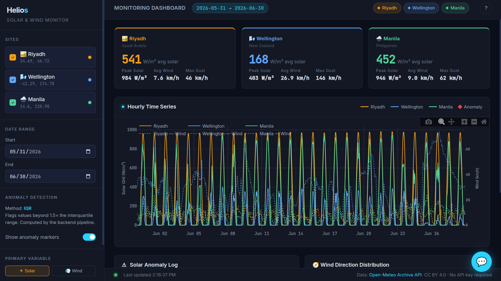

# Helios — Solar & Wind Monitor

Full-stack solar and wind monitoring dashboard with an AI chatbot assistant.



---

## System architecture



---

## Repository layout

```
weather_dashboard/
├── helios-frontend/            ← React + Plotly frontend
│   ├── index.html
│   ├── styles/
│   │   └── main.css
│   ├── js/
│   │   └── app.js
│   └── favicon/
│
├── helios-backend/             ← Flask data API + ETL pipeline
│   ├── app.py
│   ├── config.py
│   ├── api/routes.py
│   ├── db/
│   │   ├── schema.py
│   │   └── queries.py
│   ├── etl/
│   │   ├── fetch.py
│   │   ├── clean.py
│   │   ├── normalize.py
│   │   └── pipeline.py
│   └── tests/
│       ├── test_etl.py
│       ├── test_api.py
│       └── test_dashboard_e2e.py
│
└── chatbot/                    ← RAG chatbot service (FastAPI + LangChain)
    ├── app.py
    ├── rag.py
    ├── config.py
    ├── ingest.py
    ├── knowledge/              ← markdown documents the AI is grounded in
    │   ├── overview.md
    │   ├── sites.md
    │   ├── metrics.md
    │   ├── anomaly_detection.md
    │   ├── ui_guide.md
    │   └── api_reference.md
    ├── chroma_db/              ← auto-created vector index (git-ignored)
    ├── tests/
    │   ├── conftest.py
    │   ├── test_api.py
    │   └── test_rag.py
    └── requirements.txt
```

---

## Services overview

| Service | Port | Description |
|---------|------|-------------|
| Flask data API | **5000** | Serves cleaned solar/wind data from SQLite |
| Chatbot RAG API | **8000** | AI Q&A backed by LangChain + ChromaDB + Ollama |
| Static dev server | any | Serves `helios-frontend/index.html` during development |

---

## Part 1 — Flask data backend

### Prerequisites

- Python 3.10+
- Redis (for Celery task queue)

```bash
# Install Redis (Ubuntu/Debian)
sudo apt install redis-server
sudo systemctl start redis

# macOS
brew install redis && brew services start redis
```

### Installation

```bash
cd helios-backend
python3 -m venv venv
source venv/bin/activate        # Windows: venv\Scripts\activate
pip install -r requirements.txt
```

### First-time setup

```bash
# 1. Create the SQLite database and tables
python -m db.schema

# 2. Pull 30 days of data for all three sites (one-time backfill)
python -m etl.pipeline

# 3. Start the API server
python app.py
# → http://localhost:5000
```

### Celery scheduler

The ETL pipeline runs automatically every day at **00:00 UTC** via Celery Beat.
Open two additional terminals after starting Flask:

```bash
# Terminal A — Celery worker (executes tasks)
source venv/bin/activate
celery -A celery_app worker --loglevel=info

# Terminal B — Celery Beat (fires the schedule)
source venv/bin/activate
celery -A celery_app beat --loglevel=info
```

The Beat scheduler emits the `tasks.run_daily_pipeline` task at midnight UTC every day.
The worker picks it up, fetches the last 30 days of data from Open-Meteo for all three
sites, cleans it, flags anomalies, and upserts into the SQLite database.

#### Trigger the pipeline manually

```bash
# Dispatch an immediate run for all sites (async — returns task ID)
curl -s -X POST http://localhost:5000/api/pipeline/trigger | python -m json.tool

# Run for a specific site and date range
curl -s -X POST http://localhost:5000/api/pipeline/trigger \
  -H "Content-Type: application/json" \
  -d '{"site": "riyadh", "start": "2026-06-01", "end": "2026-06-30"}' \
  | python -m json.tool

# Check task status (use task_id from the trigger response)
curl -s http://localhost:5000/api/pipeline/task/<task_id> | python -m json.tool
```

#### Schedule configuration

| Setting | Default | Env var override |
|---------|---------|-----------------|
| Cron time | `00:00 UTC` | Edit `PIPELINE_CRON_HOUR` / `PIPELINE_CRON_MINUTE` in `config.py` |
| Broker URL | `redis://localhost:6379/0` | `CELERY_BROKER_URL` |
| Result backend | `redis://localhost:6379/0` | `CELERY_RESULT_BACKEND` |
| Days fetched | `30` | Edit `PIPELINE_DAYS_BACK` in `config.py` |

### API endpoints

| Method | Path | Description |
|--------|------|-------------|
| GET | `/api/health` | Health check |
| GET | `/api/sites` | All monitoring sites |
| GET | `/api/data?site=riyadh&start=…&end=…` | Cleaned hourly time-series |
| GET | `/api/data/multi?sites=riyadh,manila` | Multiple sites at once |
| GET | `/api/anomalies?site=riyadh` | Anomaly-flagged rows |
| GET | `/api/stats?site=riyadh` | Summary statistics |
| GET | `/api/pipeline/runs` | ETL audit log |
| POST | `/api/pipeline/trigger` | Dispatch pipeline task to Celery (async) |
| GET | `/api/pipeline/task/<id>` | Check queued task status |

### Running the tests

```bash
# from repo root
source helios-backend/venv/bin/activate

# API + ETL unit tests
pytest helios-backend/tests/test_etl.py helios-backend/tests/test_api.py -v

# Celery scheduler tests (no live Redis required — uses eager mode)
pytest helios-backend/tests/test_scheduler.py -v

# Browser end-to-end tests (requires Flask running on :5000)
pytest helios-backend/tests/test_dashboard_e2e.py -v
```

---

## Part 2 — Chatbot RAG service

The chatbot is a **Retrieval-Augmented Generation (RAG)** pipeline:

```
User question
    ↓
FastAPI (port 8000)
    ↓
LangChain RetrievalQA
    ├── sentence-transformers → embed the question
    ├── ChromaDB              → retrieve top-4 relevant chunks
    └── Ollama LLM            → generate a grounded answer
    ↓
JSON response { reply, sources }
    ↓
Dashboard chatbot panel
```

### Prerequisites

1. **Python 3.10+**
2. **Ollama** — install from [ollama.com](https://ollama.com) then pull a model:

```bash
# Install Ollama (Linux)
curl -fsSL https://ollama.com/install.sh | sh

# Pull a model (llama3.2 is the default; ~2 GB)
ollama pull llama3.2

# Alternative lighter models
ollama pull mistral     # ~4 GB, higher quality
ollama pull gemma2:2b   # ~1.6 GB, fastest
```

3. Ollama must be **running** before starting the chatbot service:

```bash
ollama serve   # starts the Ollama server on localhost:11434
```

### Installation

```bash
cd chatbot
python3 -m venv venv
source venv/bin/activate        # Windows: venv\Scripts\activate
pip install -r requirements.txt
```

### Build the vector index

This step embeds the knowledge documents and stores them in ChromaDB. Run once, then again whenever you edit files in `chatbot/knowledge/`.

```bash
# from the chatbot/ directory
python ingest.py

# Force a full rebuild (e.g. after editing knowledge docs)
python ingest.py --force

# Custom paths or model
python ingest.py --knowledge ./knowledge --chroma ./chroma_db --model all-MiniLM-L6-v2
```

Expected output:
```
2026-06-29 12:00:00  INFO  Knowledge dir : .../chatbot/knowledge
2026-06-29 12:00:00  INFO  Found 6 knowledge file(s):
2026-06-29 12:00:00  INFO    anomaly_detection.md
2026-06-29 12:00:00  INFO    api_reference.md
...
2026-06-29 12:00:15  INFO  Index rebuilt: 87 chunks
2026-06-29 12:00:15  INFO  Smoke test passed. Reply snippet: Helios is a solar and wind…
```

### Start the chatbot service

```bash
# from the chatbot/ directory
uvicorn app:app --host 0.0.0.0 --port 8000 --reload
```

Expected output:
```
INFO  Starting Helios chatbot service…
INFO  Initialising embeddings model: all-MiniLM-L6-v2
INFO  Initialising Ollama LLM: llama3.2 @ http://localhost:11434
INFO  Loading existing ChromaDB from .../chatbot/chroma_db
INFO  RAG pipeline ready — 87 chunks indexed
INFO  Uvicorn running on http://0.0.0.0:8000
```

### Chatbot API endpoints

| Method | Path | Description |
|--------|------|-------------|
| GET | `/health` | Liveness check; returns model name and chunk count |
| POST | `/chat` | Ask a question; returns `{ reply, sources }` |
| POST | `/rebuild` | Rebuild ChromaDB index from knowledge docs |

#### Example: ask a question

```bash
curl -s -X POST http://localhost:8000/chat \
  -H "Content-Type: application/json" \
  -d '{"message": "What anomaly detection method does Helios use?"}' | python -m json.tool
```

```json
{
  "reply": "Helios uses the IQR (Interquartile Range) method by default. It flags values outside Q1 − 1.5×IQR and Q3 + 1.5×IQR. Solar anomalies are computed on daytime hours only to avoid nighttime zeros skewing the bounds.",
  "sources": ["anomaly_detection.md"]
}
```

#### Example: rebuild index after editing knowledge docs

```bash
curl -X POST http://localhost:8000/rebuild
```

### Configuration

All settings can be overridden via environment variables prefixed `HELIOS_CHAT_`:

| Variable | Default | Description |
|----------|---------|-------------|
| `HELIOS_CHAT_LLM_MODEL` | `llama3.2` | Ollama model tag |
| `HELIOS_CHAT_OLLAMA_BASE_URL` | `http://localhost:11434` | Ollama server URL |
| `HELIOS_CHAT_EMBEDDING_MODEL` | `all-MiniLM-L6-v2` | sentence-transformers model |
| `HELIOS_CHAT_TEMPERATURE` | `0.2` | LLM sampling temperature |
| `HELIOS_CHAT_TOP_K` | `4` | Chunks retrieved per query |
| `HELIOS_CHAT_CHUNK_SIZE` | `600` | Characters per document chunk |
| `HELIOS_CHAT_CHUNK_OVERLAP` | `80` | Overlap between chunks |
| `HELIOS_CHAT_API_PORT` | `8000` | FastAPI listen port |

Example — switch to Mistral:

```bash
HELIOS_CHAT_LLM_MODEL=mistral uvicorn app:app --port 8000
```

Or use a `.env` file in `chatbot/`:

```env
HELIOS_CHAT_LLM_MODEL=mistral
HELIOS_CHAT_TEMPERATURE=0.3
HELIOS_CHAT_TOP_K=6
```

### Extending the knowledge base

Add or edit markdown files in `chatbot/knowledge/`, then rebuild:

```bash
# edit chatbot/knowledge/my_new_topic.md
python ingest.py --force
# or via API:
curl -X POST http://localhost:8000/rebuild
```

The chatbot will immediately use the updated index.

### Running the chatbot tests

No running Ollama server required — the LLM is mocked.

```bash
# from repo root
source chatbot/venv/bin/activate
pytest chatbot/tests/ -v
```

Expected output:
```
chatbot/tests/test_api.py::TestHealth::test_returns_200 PASSED
chatbot/tests/test_api.py::TestChat::test_valid_message_returns_200 PASSED
...
chatbot/tests/test_rag.py::TestDocumentLoading::test_knowledge_dir_has_md_files PASSED
...
== 47 passed in 28.41s ==
```

---

## Part 3 — Frontend dashboard

### First-time visitor walkthrough

When you open the dashboard for the first time, here is what you are looking at and how to use each part.

---

#### 1. The sidebar (left panel)

The sidebar is your control panel. Everything you change here updates the charts in real time after you click **↻ Refresh Data**.

**Sites**
Three monitoring locations are listed — 🏜️ Riyadh, 🌬️ Wellington, and 🌧️ Manila. Each has a coloured checkbox next to it. Click a site to toggle it on or off. You can view one, two, or all three sites at the same time. Active sites appear with their checkbox filled in their site colour.

**Date Range**
Pick the start and end dates for the data you want to see. The maximum window is 90 days. Both pickers are linked — changing the start date automatically adjusts the end date if the window would exceed the limit, and vice versa. Today's date is always selectable as the end date.

**Anomaly Detection**
This section shows the active method (IQR — interquartile range). Toggle **Show anomaly markers** on to overlay red diamond markers on the chart wherever the pipeline flagged an unusual reading. Toggle it off for a cleaner view.

**Primary Variable**
Choose what the main chart line shows:
- ☀ **Solar** — plots Solar GHI (W/m², watts per square metre) on the left axis
- 💨 **Wind** — plots Wind Speed (km/h) on the left axis

**Secondary overlay**
When switched on, a second line is added to the chart on its own right-hand axis showing the opposite variable (e.g. if Solar is primary, Wind becomes the overlay, and vice versa). This is useful for spotting correlations — for example, whether cloudy periods that drop solar output also bring higher wind.

**↻ Refresh Data**
Click this button to fetch data for the selected sites and date range. It loads from the Flask API on port 5000. The button shows a spinner while loading.

---

#### 2. The top bar

The top bar runs across the top of the main canvas and shows which sites are currently loaded as coloured chips (e.g. 🏜️ Riyadh in amber, 🌬️ Wellington in blue, 🌧️ Manila in green). This gives you a quick glance at what is active without looking at the sidebar.

---

#### 3. KPI cards

Below the top bar, three summary cards appear — one for each site regardless of whether it is active (inactive sites are dimmed). Each card shows:

| Stat | Meaning |
|------|---------|
| **Avg Solar** | Average daytime Solar GHI in W/m² for the selected period |
| **Peak Solar** | Highest single hourly Solar GHI reading |
| **Avg Wind** | Average wind speed in km/h across all hours |
| **Max Gust** | Highest single wind gust recorded |

The top border of each card is coloured in its site colour so you can match it to the chart lines at a glance.

---

#### 4. Hourly Time Series chart

This is the main chart. It shows the selected variable (Solar or Wind) plotted hour by hour across your chosen date range. Multiple site lines appear together so you can compare trends directly.

- **Hover** over the chart to see the exact reading for each site at that hour.
- **Click and drag** to zoom into a specific period. Double-click to zoom back out.
- **Red diamond markers** appear on the line where the IQR pipeline flagged a reading as anomalous (only visible when anomaly markers are turned on).
- When the **secondary overlay** is on, a second y-axis appears on the right side of the chart for the overlaid variable.

---

#### 5. Wind Direction Distribution (rose charts)

Below the time series, a wind rose chart appears for each active site. A wind rose shows the frequency and strength of wind from each compass direction. The longer a petal, the more often wind came from that direction during the selected period. Petals are colour-banded by wind speed range.

This is particularly revealing for Wellington, which is dominated by strong southwesterly and northerly winds due to its Cook Strait position.

---

#### 6. Anomaly Log

A table at the bottom lists every hour that was flagged as anomalous in the loaded data. Columns show:

| Column | Meaning |
|--------|---------|
| **Site** | Which monitoring location |
| **Timestamp** | The exact hour of the flagged reading |
| **Solar GHI** | Solar value at that hour |
| **Wind** | Wind speed and gust at that hour |
| **Flags** | Which variables were flagged (solar / wind / both) |

The panel header shows the total number of flagged hours. If no anomalies exist in the selected range, the table is empty.

---

#### 7. The AI assistant (💬 button)

A floating **💬** button sits in the bottom-right corner of the page. Click it to open the Helios AI chatbot panel.

The chatbot is powered by a local LLM (via Ollama) and a RAG pipeline grounded in the dashboard's knowledge base. You can ask it questions like:

- *"What anomaly detection method does Helios use?"*
- *"Were there any anomalous wind readings in the last 7 days?"*
- *"Which site had the highest average solar radiation last week?"*
- *"Tell me about Wellington."*

Quick-access suggestion buttons appear at the bottom of the chat panel so you do not have to type from scratch. The coloured dot in the chat header is **green** when the chatbot service is reachable and **red** when it is offline (check that `uvicorn app:app --port 8000` is running in the chatbot directory).

> **Note:** Time-sensitive questions ("last 7 days", "past week", "this month") are answered directly from the live database, not from static documents, so the numbers are always current.

---

#### Quick-start checklist for first-time use

1. Make sure all three services are running (see [Starting all three services together](#starting-all-three-services-together) below)
2. Open `http://localhost:8080`
3. In the sidebar, confirm at least one site is checked
4. Set your date range (default is the last 30 days)
5. Click **↻ Refresh Data**
6. Toggle **Show anomaly markers** on to see flagged readings
7. Switch the **Primary Variable** between Solar and Wind to explore different views
8. Enable the **Secondary overlay** to compare both variables at once
9. Click **💬** to open the AI assistant and ask a question

---

### Opening the dashboard

Serve the `helios-frontend/` folder over HTTP (required so browser fetch calls work correctly):

```bash
# Option A — Python built-in server
cd helios-frontend
python3 -m http.server 8080
# → open http://localhost:8080

# Option B — Any static server
npx serve helios-frontend/
```

### Starting all three services together

Open three terminals:

```bash
# Terminal 1 — Ollama LLM server
ollama serve

# Terminal 2 — Flask data API
cd helios-backend && source venv/bin/activate && python app.py

# Terminal 3 — Chatbot RAG API
cd chatbot && source venv/bin/activate && uvicorn app:app --port 8000
```

Then open `http://localhost:8080`.

The floating 💬 button in the bottom-right corner is the AI assistant. The status dot in the chat header is green when the chatbot service is reachable, red when it's offline.

---

## Troubleshooting

| Problem | Fix |
|---------|-----|
| `ModuleNotFoundError` | Activate the correct venv for the service |
| `No such table: sites` | Run `python -m db.schema` first |
| Chart not showing data | Confirm Flask is running on port 5000 |
| Chatbot dot is red | Start the chatbot service: `uvicorn app:app --port 8000` |
| `connection refused` on `/chat` | Ollama is not running — run `ollama serve` |
| LLM returns empty reply | Model may not be pulled — run `ollama pull llama3.2` |
| Slow first response | Model is loading into memory; subsequent queries are faster |
| `ValueError: No markdown documents` | `chatbot/knowledge/` is empty or wrong path |
| Port 5000 already in use | Change `FLASK_PORT` in `helios-backend/config.py` |
| Port 8000 already in use | `uvicorn app:app --port 8001` and update `CHATBOT_API` in the HTML |

---

## Data source

[Open-Meteo Archive API](https://open-meteo.com) · Free · No API key required · CC BY 4.0


## Notes for future use

### Scheduler — remember to run the Celery servers

The Flask API (`python app.py`) does **not** pull data on its own. The daily 00:00 UTC
pipeline only runs when two extra processes are running alongside Flask:

```bash
# Must be kept alive alongside the API server

# Celery worker — executes the pipeline task when triggered
celery -A celery_app worker --loglevel=info

# Celery Beat — fires the scheduled task every day at 00:00 UTC
celery -A celery_app beat --loglevel=info
```

If either process is stopped, data will stop being fetched until it is restarted.
To verify the schedule is active, check the Beat terminal for a line like:

```
Scheduler: Sending due task daily-etl-pipeline (tasks.run_daily_pipeline)
```

You can also trigger a manual run at any time without waiting for midnight:

```bash
curl -s -X POST http://localhost:5000/api/pipeline/trigger | python -m json.tool
```

---

### Database size — potential optimisations

Daily fetching for 3 sites produces ~72 rows/day. If the database grows too large,
consider the following approaches:

1. **Drop `raw_observations` entirely** — saves ~559 KB (43% of the DB).
   It is written by `upsert_raw()` but never read by any API route. It exists as an
   audit copy; Open-Meteo is always available to re-fetch. Dropping the table and its
   two indexes is the biggest single win.

2. **Drop internal-only columns from `cleaned_observations`** — saves ~100 KB.
   `solar_zscore`, `wind_zscore`, `solar_iqr_flag`, `wind_iqr_flag` are ETL scratch
   values that `query_cleaned()` pulls to the frontend, which ignores them. Only
   `solar_anomaly` / `wind_anomaly` are actually consumed. Removing the 4 columns cuts
   ~32 bytes × number of rows.

3. **Use a rolling retention window** — controls long-term growth.
   At 72 rows/day the DB grows ~2.5 MB/year. A simple purge run inside the pipeline:
   ```sql
   DELETE FROM cleaned_observations WHERE observed_at < date('now', '-365 days');
   ```
   keeps size permanently bounded without losing meaningful history for the dashboard.